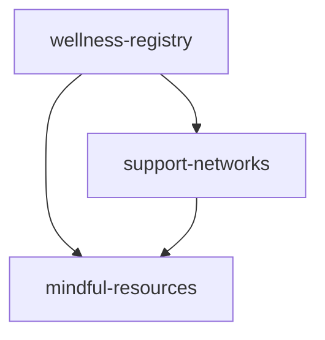

# Community Mental Wellness Platform - API Guide

## Overview

This guide provides comprehensive documentation for integrating with the Community Mental Wellness Platform smart contracts. The platform consists of three main contracts that work together to provide a complete mental health ecosystem.

## Contract Architecture

### Core Contracts

1. **wellness-registry.clar** - Practitioner and resource registry
2. **support-networks.clar** - Peer support and crisis response
3. **mindful-resources.clar** - Wellness content and tracking

### Contract Dependencies



## Authentication & Access Control

### Roles

- **Anonymous Users**: Can browse public resources and request crisis support
- **Registered Users**: Can join groups, track wellness, participate in programs
- **Practitioners**: Licensed professionals who can create resources and moderate
- **Administrators**: Platform management and crisis response coordination

### Permission System

Each contract implements role-based access control:
- Public functions available to all users
- Restricted functions require specific roles
- Crisis functions have immediate access with logging

## Wellness Registry API

### Practitioner Registration

Register as a mental health practitioner on the platform.

```clarity
(register-practitioner 
  (name (string-utf8 100))
  (license-number (string-utf8 50))
  (specializations (list 10 (string-utf8 100)))
  (years-experience uint)
  (education-background (string-utf8 500))
  (therapeutic-approaches (list 8 (string-utf8 100)))
  (languages-spoken (list 5 (string-utf8 50)))
  (service-areas (list 10 (string-utf8 100)))
  (availability (string-utf8 200))
  (contact-preferences (string-utf8 100))
  (insurance-accepted (optional (string-utf8 200)))
  (cultural-competencies (list 5 (string-utf8 100))))
```

**Example Usage:**
```bash
clarinet call wellness-registry register-practitioner \
  '"Dr. Sarah Johnson"' \
  '"PSY12345"' \
  '["anxiety", "depression", "trauma"]' \
  u8 \
  '"PhD Clinical Psychology"' \
  '["CBT", "EMDR", "DBT"]' \
  '["English", "Spanish"]' \
  '["Individual therapy", "Group therapy"]' \
  '"Weekdays 9-5"' \
  '"Email preferred"' \
  '(some "Most major insurance plans")' \
  '["LGBTQ+ affirming", "Trauma-informed"]'
```

### Community Resource Management

Add wellness resources to the community library.

```clarity
(add-community-resource
  (resource-title (string-utf8 200))
  (description (string-utf8 1000))
  (content-hash (optional (string-utf8 64)))
  (resource-type (string-utf8 50))
  (target-audience (list 5 (string-utf8 100)))
  (wellness-categories (list 8 (string-utf8 100)))
  (difficulty-level uint)
  (estimated-duration (optional uint))
  (accessibility-notes (optional (string-utf8 300)))
  (trigger-warnings (optional (string-utf8 200)))
  (quality-rating uint)
  (evidence-level uint)
  (languages-available (list 3 (string-utf8 50))))
```

**Example Usage:**
```bash
clarinet call wellness-registry add-community-resource \
  '"Mindfulness Guide for Beginners"' \
  '"Comprehensive introduction to mindfulness meditation"' \
  '(some "ipfs://QmHashExample...")' \
  '"guide"' \
  '["adults", "beginners"]' \
  '["mindfulness", "meditation", "stress-relief"]' \
  u1 \
  '(some u20)' \
  '(some "Audio descriptions available")' \
  '(some "Contains references to trauma")' \
  u4 \
  u3 \
  '["English", "Spanish"]'
```

### Safe Space Creation

Create moderated community spaces for support discussions.

```clarity
(create-safe-space
  (space-name (string-utf8 100))
  (space-type (string-utf8 50))
  (description (string-utf8 800))
  (guidelines (string-utf8 500))
  (focus-areas (list 10 (string-utf8 100)))
  (meeting-schedule (string-utf8 150))
  (location-type (string-utf8 30))
  (location-details (optional (string-utf8 200)))
  (max-capacity uint)
  (entry-requirements (optional (string-utf8 300)))
  (moderation-style (string-utf8 50))
  (crisis-protocols (string-utf8 300)))
```

## Support Networks API

### Peer Support Registration

Register for peer support network access.

```clarity
(register-for-support
  (member-id (string-utf8 64))
  (preferred-name (string-utf8 50))
  (support-preferences (list 10 (string-utf8 100)))
  (availability-schedule (string-utf8 200))
  (age-range (optional (string-utf8 50)))
  (support-experience (list 8 (string-utf8 100)))
  (comfort-topics (list 15 (string-utf8 100)))
  (communication-style (string-utf8 100))
  (is-crisis-responder bool)
  (max-concurrent-connections uint)
  (privacy-settings (string-utf8 100))
  (emergency-contacts (list 3 (string-utf8 200)))
  (preferred-languages (list 3 (string-utf8 50))))
```

### Support Group Management

Create and manage peer support groups.

```clarity
(create-support-group
  (group-name (string-utf8 150))
  (facilitator-id uint)
  (focus-area (string-utf8 100))
  (description (string-utf8 800))
  (meeting-format (string-utf8 50))
  (meeting-schedule (string-utf8 200))
  (location-type (string-utf8 30))
  (location-details (optional (string-utf8 200)))
  (group-guidelines (string-utf8 1000))
  (entry-requirements (optional (string-utf8 500)))
  (max-capacity uint)
  (crisis-protocols (string-utf8 400))
  (age-range (optional (string-utf8 50)))
  (cultural-focus (optional (string-utf8 100))))
```

### Crisis Support System

Request immediate crisis support (anonymous option available).

```clarity
(request-crisis-support
  (crisis-type (string-utf8 50))
  (location (optional (string-utf8 200)))
  (description (string-utf8 500)))
```

**Crisis Types:**
- `anxiety-attack`
- `panic-episode`
- `depression-crisis`
- `suicidal-thoughts`
- `self-harm-urge`
- `substance-abuse`
- `trauma-trigger`
- `general-distress`

### Wellness Check-ins

Submit regular wellness self-assessments.

```clarity
(submit-wellness-checkin
  (energy-level uint)      ; 1-10 scale
  (stress-level uint)      ; 1-10 scale  
  (sleep-quality uint)     ; 1-10 scale
  (social-connection uint) ; 1-10 scale
  (coping-effectiveness uint) ; 1-10 scale
  (checkin-date uint)
  (notes (optional (string-utf8 400)))
  (goal-progress (optional uint))
  (challenges-faced (optional (string-utf8 300)))
  (victories-celebrated (optional (string-utf8 300)))
  (next-goals (optional (string-utf8 200))))
```

## Mindful Resources API

### Resource Library

Add wellness resources with comprehensive metadata.

```clarity
(add-resource
  (title (string-utf8 200))
  (creator-id uint)
  (category (string-utf8 50))
  (description (string-utf8 1000))
  (content-hash (optional (string-utf8 64)))
  (difficulty-level uint)
  (duration-minutes uint)
  (target-audience (list 8 (string-utf8 100)))
  (wellness-focus-areas (list 10 (string-utf8 100)))
  (prerequisites (optional (string-utf8 300)))
  (learning-outcomes (list 8 (string-utf8 150)))
  (accessibility-features (list 5 (string-utf8 100)))
  (trigger-warnings (optional (string-utf8 200)))
  (quality-rating uint)
  (evidence-level uint)
  (languages-available (list 5 (string-utf8 50)))
  (age-appropriateness (string-utf8 50)))
```

### Meditation Session Scheduling

Schedule guided meditation sessions.

```clarity
(schedule-meditation-session
  (session-title (string-utf8 150))
  (facilitator-id uint)
  (session-type (string-utf8 50))
  (meditation-style (string-utf8 50))
  (description (string-utf8 600))
  (session-date uint)
  (duration-minutes uint)
  (max-participants uint)
  (requires-registration bool)
  (session-format (string-utf8 30))
  (location (optional (string-utf8 150)))
  (experience-level (string-utf8 20))
  (focus-intention (string-utf8 200))
  (guided-elements (list 8 (string-utf8 100)))
  (music-soundscape (optional (string-utf8 100)))
  (preparation-notes (optional (string-utf8 300)))
  (accessibility-level uint)
  (mindfulness-techniques (list 6 (string-utf8 100))))
```

### Wellness Journey Creation

Create structured wellness improvement programs.

```clarity
(create-wellness-journey
  (journey-name (string-utf8 150))
  (creator-id uint)
  (journey-type (string-utf8 50))
  (wellness-goals (list 8 (string-utf8 150)))
  (difficulty-level uint)
  (target-completion uint)
  (start-date uint)
  (total-milestones uint)
  (requires-mentorship bool)
  (daily-practices (list 10 (string-utf8 100)))
  (journey-description (optional (string-utf8 1000)))
  (professional-guidance (optional principal)))
```

### Activity Logging

Track wellness activities and measure progress.

```clarity
(log-wellness-activity
  (activity-name (string-utf8 100))
  (activity-type (string-utf8 50))
  (activity-date uint)
  (duration-minutes uint)
  (intensity-level uint)
  (related-journey-id (optional uint))
  (related-session-id (optional uint))
  (stress-before uint)
  (stress-after uint)
  (focus-level uint)
  (enjoyment-rating uint)
  (notes (optional (string-utf8 400)))
  (location (optional (string-utf8 100)))
  (companions (list 5 principal)))
```

## Data Models

### Core Data Structures

#### Practitioner Profile
```clarity
{
  id: uint,
  principal: principal,
  name: string-utf8,
  license-number: string-utf8,
  specializations: list,
  years-experience: uint,
  verification-status: string-utf8,
  community-rating: uint,
  total-clients: uint,
  registration-date: uint,
  last-active: uint,
  is-active: bool
}
```

#### Support Group
```clarity
{
  id: uint,
  creator: principal,
  group-name: string-utf8,
  focus-area: string-utf8,
  current-members: uint,
  max-capacity: uint,
  creation-date: uint,
  last-activity: uint,
  is-active: bool,
  privacy-level: string-utf8,
  meeting-schedule: string-utf8
}
```

#### Wellness Resource
```clarity
{
  id: uint,
  creator: principal,
  title: string-utf8,
  category: string-utf8,
  quality-rating: uint,
  usage-count: uint,
  creation-date: uint,
  last-updated: uint,
  is-featured: bool,
  community-rating: uint
}
```

## Error Handling

### Common Error Codes

| Error Code | Description | Resolution |
|------------|-------------|------------|
| `err-not-authorized` | Insufficient permissions | Check user role and authentication |
| `err-already-exists` | Resource already exists | Use update function instead |
| `err-not-found` | Resource not found | Verify ID exists |
| `err-invalid-input` | Invalid parameter | Check data types and constraints |
| `err-capacity-exceeded` | Maximum capacity reached | Reduce participants or upgrade |
| `err-crisis-escalation` | Crisis requires immediate attention | Contact emergency services |

### Error Response Format

```clarity
{
  success: false,
  error: "err-code",
  message: "Human-readable description",
  details: {
    parameter: "invalid-value",
    expected: "expected-format"
  }
}
```

## Integration Examples

### JavaScript/TypeScript

```typescript
import { openContractCall } from '@stacks/connect';
import { uintCV, stringUtf8CV, listCV, someCV, noneCV } from '@stacks/transactions';

// Register practitioner example
const registerPractitioner = async () => {
  const functionArgs = [
    stringUtf8CV("Dr. Jane Smith"),
    stringUtf8CV("PSY12345"),
    listCV([stringUtf8CV("anxiety"), stringUtf8CV("depression")]),
    uintCV(5),
    stringUtf8CV("PhD Psychology"),
    listCV([stringUtf8CV("CBT"), stringUtf8CV("DBT")]),
    listCV([stringUtf8CV("English")]),
    listCV([stringUtf8CV("Individual therapy")]),
    stringUtf8CV("Weekdays 9-5"),
    stringUtf8CV("Email"),
    someCV(stringUtf8CV("Sliding scale")),
    listCV([stringUtf8CV("LGBTQ+ affirming")])
  ];

  await openContractCall({
    contractAddress: 'ST1234...', // Your contract address
    contractName: 'wellness-registry',
    functionName: 'register-practitioner',
    functionArgs,
    onFinish: (data) => {
      console.log('Registration successful:', data);
    }
  });
};
```

### Python Integration

```python
from stacks_transactions import make_contract_call, uintCV, stringUtf8CV

# Submit wellness check-in
def submit_wellness_checkin(private_key, network):
    contract_call = make_contract_call(
        contract_address="ST1234...",
        contract_name="support-networks", 
        function_name="submit-wellness-checkin",
        function_args=[
            uintCV(7),  # energy-level
            uintCV(4),  # stress-level  
            uintCV(8),  # sleep-quality
            uintCV(6),  # social-connection
            uintCV(7),  # coping-effectiveness
            uintCV(1703980800),  # checkin-date
            # ... additional parameters
        ],
        sender_key=private_key,
        network=network
    )
    return contract_call
```

## Rate Limits & Best Practices

### Rate Limiting

- **General API calls**: 100 requests per minute per user
- **Crisis support requests**: No limit (immediate processing)
- **Data queries**: 500 requests per hour
- **Resource uploads**: 10 uploads per day

### Best Practices

1. **Batch Operations**: Group related operations to reduce transaction costs
2. **Data Validation**: Always validate inputs client-side before contract calls
3. **Error Handling**: Implement comprehensive error handling and user feedback
4. **Privacy**: Use anonymous functions for sensitive data when available
5. **Performance**: Cache frequently accessed data to improve user experience

### Security Guidelines

1. **Input Sanitization**: Sanitize all user inputs before processing
2. **Permission Checks**: Always verify user permissions before sensitive operations
3. **Crisis Handling**: Ensure crisis requests trigger immediate response protocols
4. **Data Encryption**: Encrypt sensitive wellness data before storage
5. **Audit Logging**: Log all significant platform interactions for security analysis

## Testing & Development

### Test Environment Setup

```bash
# Install Clarinet
curl -L https://github.com/hirosystems/clarinet/releases/download/v1.8.0/clarinet-linux-x64.tar.gz | tar xz

# Clone project
git clone https://github.com/yourusername/community-mental-wellness.git
cd community-mental-wellness

# Install dependencies
npm install

# Run tests
clarinet test

# Start local development chain
clarinet integrate
```

### Mock Data

Use the provided test utilities for consistent testing:

```typescript
import { MentalWellnessTestSuite, TestData } from './tests/test-utils.ts';

// Create test practitioner
const practitioner = TestData.practitioners.psychologist;
testSuite.registerPractitioner(account, practitioner.name, practitioner.license);

// Create test support group
const group = TestData.supportGroups.anxietySupport;
testSuite.createSupportGroup(account, group.name, group.focusArea);
```

## Support & Community

### Getting Help

- **Documentation**: [https://docs.community-mental-wellness.org](https://docs.community-mental-wellness.org)
- **Discord Community**: [Discord Invite Link]
- **GitHub Issues**: [https://github.com/yourusername/community-mental-wellness/issues](https://github.com/yourusername/community-mental-wellness/issues)
- **Developer Support**: dev-support@community-mental-wellness.org

### Contributing

We welcome contributions from developers, mental health professionals, and community members. See our [Contributing Guide](CONTRIBUTING.md) for details on how to get involved.

---

*This API guide is actively maintained and updated. For the latest information, please refer to the project repository.*